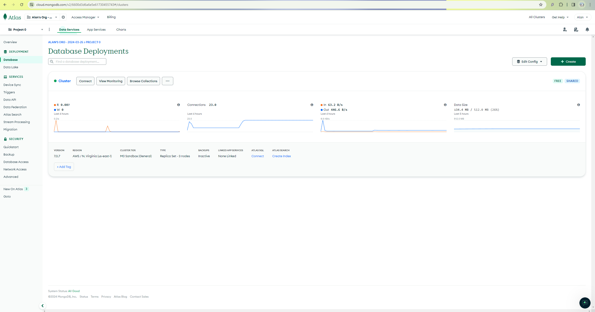
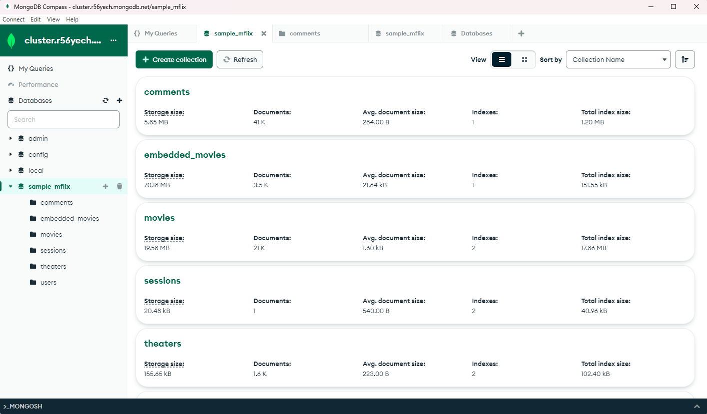
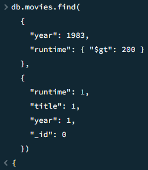
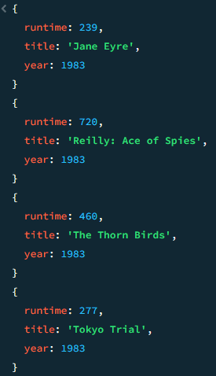
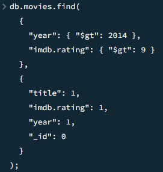
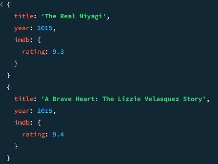

# Assignment-3-MongoDB-Setup-and-Queries
## 0. Create a GitHub Repository
  https://github.com/AlanCTB/Assignment-3-MongoDB-Setup-and-Queries
## 1. Sign up MongoDB Atlas
MongoDB Atlas Screenshot: 

## 2 & 3. Run Queries using MongoDB Compass. Install MongoDB Community Edition
MongoDB Compass Screenshot:

## 4. Assignment
### Query 1: 
(1) Find all movies with runtime greater than 200 minutes in year 1983. The result should include a list of objects sorted by runtime increasing, and each object only has three fields: runtime, title, year. An example result is shown in the following screenshot.
```
db.movies.find(
  { 
    "year": 1983, 
    "runtime": { "$gt": 200 }
  },
  {
    "runtime": 1, 
    "title": 1, 
    "year": 1, 
    "_id": 0
  }
)
```
#### Screenshots:


### Query 2:
(2) Find all movies after year 2014 with imdb rating greater than 9. An example query result is shown in the following screenshot.
```
db.movies.find(
  { 
    "year": { "$gt": 2014 }, 
    "imdb.rating": { "$gt": 9 }
  },
  {
    "title": 1, 
    "imdb.rating": 1, 
    "year": 1, 
    "_id": 0
  }
);
```
#### Screenshots: 


